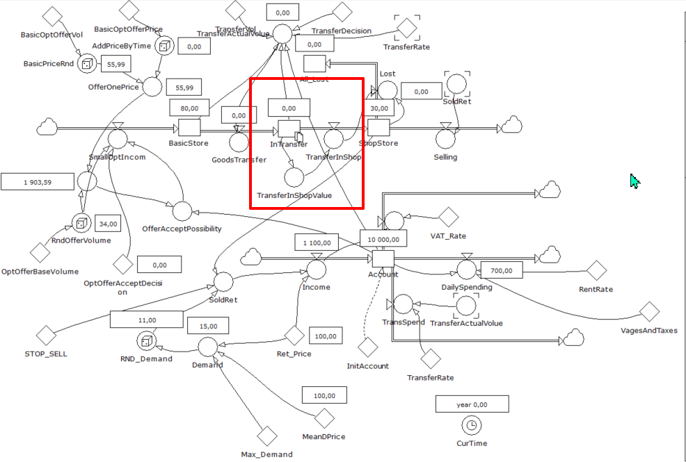
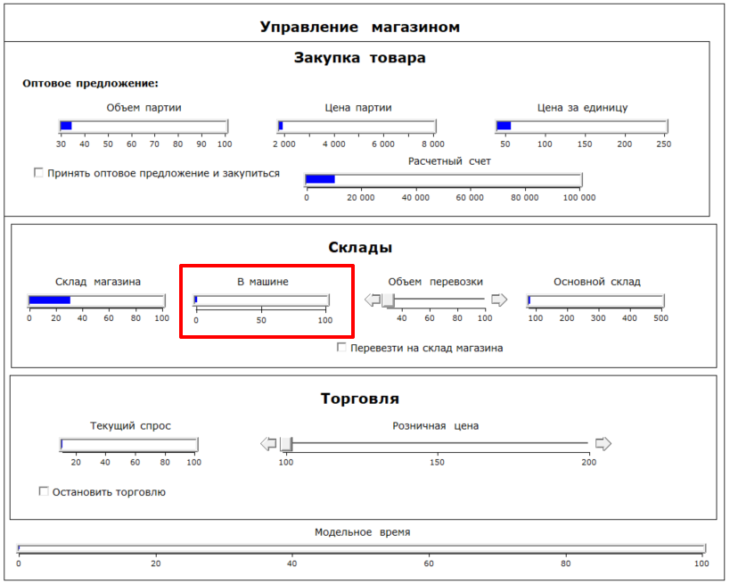

# im_lab3
## Постановка задачи
Внести изменения в модель так, чтобы появился хотя бы еще один уровень, связанный с другими элементами модели. Далее протестировать обновленную модель. Полученную модель преобразовать в код алгоритмического языка. Полученный код изменить так, чтобы программа предлагала вводить данные перед каждым шагом моделирования, предварительно выводя основные параметры объекта моделирования.

## Описание модели
В качестве нового уровня, связанного с другими элементами модели, был добавлен учет перевозки товара через уровень (в машину погрузили, затем выгрузили - промежуточный между складами уровень).
Новый уровень – товары в машине ```InTransfer```.
Перевозка товара работает следующим образом: 

•	Если checkbox на перевозку активирован и в данный момент в машине (уровень InTransfer) пусто, то выбранный объем перевозки загружается в машину, пропадая с основного склада (уровень BasicStore).

•	Когда в машине что-то уже есть, перенести товар на этот уровень не получится.

•	На следующем шаге товар из машины выгружается на склад магазина (уровень ShopStore). Если места на складе не хватает – товары пропадают (перемещаются на уровень All_Lost).

## Скриншоты



## Запуск 
```
Модельное время: 0/100
Расчетный счет: 10000
Объем партии: 46
Цена за ед.: 52
Цена партии: 2392
Покупаем товар?(да - 1/ нет - 0):
1
Основной склад: 80/500
В машине: 0/100
Склад магазина: 30/100
Перевозим товар?(да - 1/ нет - 0):
0
Продаем товар?(да - 1/ нет - 0):
0
---------------------
Модельное время: 1/100
Расчетный счет: 7608
Объем партии: 48
Цена за ед.: 54
Цена партии: 2592
Покупаем товар?(да - 1/ нет - 0):
0
Основной склад: 126/500
В машине: 0/100
Склад магазина: 30/100
Перевозим товар?(да - 1/ нет - 0):
1
Введите объем перевозки [20 - 100]:
20
Продаем товар?(да - 1/ нет - 0):
0
---------------------
```
